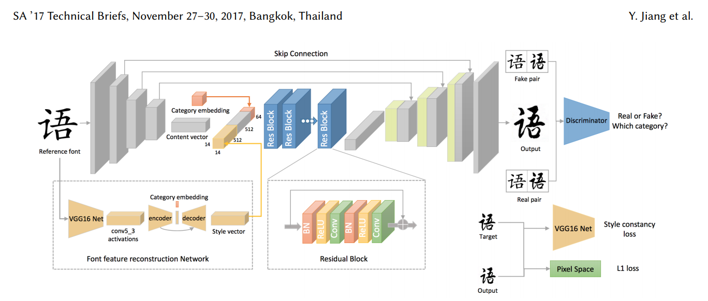

paper : http://www.icst.pku.edu.cn/zlian/docs/20181024110234919639.pdf

## Requirements 
- python 3.6
- Tensorflow 1.14
- Pillow
- numpy
- matplotlib

## Train vgg
데이터셋을 picture 폴더 안에 넣습니다
훈련시 `python train_vgg.py` 실행

## pretrain DCFont model
훈련 시간 단축을 위한 model pretrain 실행

`python dcfont.py --reference_root reference --train_root dataset --epoch 200 --step 1000 --save_path ./checkpoint/dcfont --mode train --vgg_path checkpoint/new_vgg-9277`
- `--referecne_root ` reference 이미지의 경로
- `--train_root` 폰트 이미지의 경로
- `--epoch` 훈련 진행할 epoch의 횟수 
- `--step` epcoh 당 진행할 훈련 step의 수
- `--save_path` 모델을 저장할 경로
- `--mode` train 모드 설정
- `--vgg_path` vgg ckpt 파일 경로

#### Additional settings 
- `--lr` learning rate 설정
- `--num_class` class의 갯수 설정

## Train DCFont 
모델을 Pretrain 한 후에 타겟 폰트로의 변환을 위해서 훈련을 진행

`python dcfont.py --reference_root reference --target mydataset/target --epoch 200 --step 1000 --save_path2 ./checkpoint/dcfont --mode train2 --vgg_path checkpoint/new_vgg-9277`

- `--save_path2` 모델을 저장할 경로
- `--target` 훈련시킬 타겟이미지가 있는 경로

## Test mode
훈련한 모델을 예측

`python dcfont.py --reference_root referecne --output_dir test_result --mode test --checkpoint_dir --batch_size 1 `

- `output_dir` test image를 저장할 경로
- `checkpoint_dir` 

